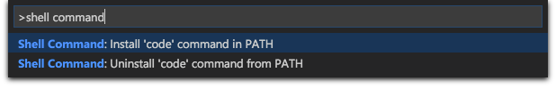

## Cursor

### Clicking to add curosors

https://code.visualstudio.com/docs/getstarted/tips-and-tricks#_multi-cursor-selection
Option+Click
To add cursors at arbitrary positions, select a position with your mouse and use (Option+Click on macOS).

### Automatically adding cursors

`Shift+Cmd+l` - cursors to all occurrences of the current selection with Shift+Cmd+L

`Cmd+d` - selects the next occurrence after the one you selected

`Cmd+k` - skips the occurance

Cmd+d AND Cmd+k
If you do not want to add all occurrences of the current selection, you can use Cmd+D instead.
This only selects the next occurrence after the one you selected so you can add selections one by one.
Cmd+k skips the occurance you are curretly on.

## Highlight

### Block Highlight

`Shift+Option` - Block Highlight

https://code.visualstudio.com/docs/getstarted/tips-and-tricks#_column-box-selection
You can select blocks of text by holding Shift+Alt (Shift+Option on macOS) while you drag your mouse. A separate cursor will be added to the end of each selected line.

## Line operations

`shift+alt+up/down` - Copy line up / down

`TBD`- move line up down

`control+shift+cmd+left/right`- shrink expand selection

https://code.visualstudio.com/docs/getstarted/tips-and-tricks#_copy-line-up-down
https://code.visualstudio.com/docs/getstarted/tips-and-tricks#_move-line-up-and-down
https://code.visualstudio.com/docs/getstarted/tips-and-tricks#_shrink-expand-selection

## Navigation

cmd+shift+o
https://code.visualstudio.com/docs/getstarted/tips-and-tricks#_go-to-symbol-in-file

https://code.visualstudio.com/docs/getstarted/tips-and-tricks#_undo-cursor-position
cmd+u

https://code.visualstudio.com/docs/getstarted/tips-and-tricks#_code-folding
Keyboard Shortcut: option+cmd+[ OR ]

https://code.visualstudio.com/docs/getstarted/tips-and-tricks#_intellisense
control+space

Toggle Sidebar Keyboard Shortcut: ⌘B
Toggle Panel Keyboard Shortcut: ⌘J
Switch between editors Keyboard Shortcut: ⌘1, ⌘2, ⌘3

## Adding the terminal command `code` to allow you to open vscode on a folder

1. Make sure you drag the Visual Studio Code application into the Applications folder (And not somewhere else)
2. Next, open Visual Studio Code Open the Command Palette via ⌘⇧P and type shell command to find the Shell Command:

   

## Extensions

Tab out of quotes, brackets, etc

- https://marketplace.visualstudio.com/items?itemName=albert.TabOut
- https://marketplace.visualstudio.com/items?itemName=YoavBls.pretty-ts-errors
- https://marketplace.visualstudio.com/items?itemName=vscodevim.vim
  - Install settings files in these locations:
    - Cmd+Shift+p => "open user settings (JSON)" => ~/Library/Application Support/Code/User/settings.json
    - Cmd+Shift+p => "open keyboard shortcuts (JSON)" => ~/Library/Application Support/Code/User/keybindings.json

## Settings:

editor.linkedEditing - Enables editing both html tags at the same time
