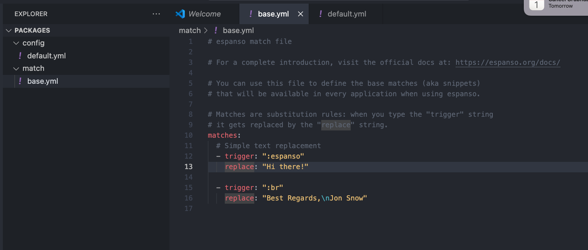

# Espanso Notes

## Use brew to install it:

brew install espanso

## Here is where things are located:

2. Use `espanso path` to get this output:
   Config: `/Users/{user}/Library/Application Support/espanso`
   Packages: `/Users/{user}/Library/Application Support/espanso/match/packages`
   Runtime: `/Users/{user}/Library/Caches/espanso`

## Setup Espanso With previous code

```shell
cd /Users/{user}/Library/Application\ Support/espanso/match/packages
mkdir config
mkdir match
cd match
touch base.yml
```

Then copy the contents of `base.yml` into this newly created `base.yml`

## Filesystem will look like this:



## Keep all future edits to hotkeys here:

with vim:
`vim /Users/aliunwala/Library/Application\ Support/espanso/match/packages/match/base.yml`
with vscode:
`code /Users/aliunwala/Library/Application\ Support/espanso/match/packages/match/base.yml`
