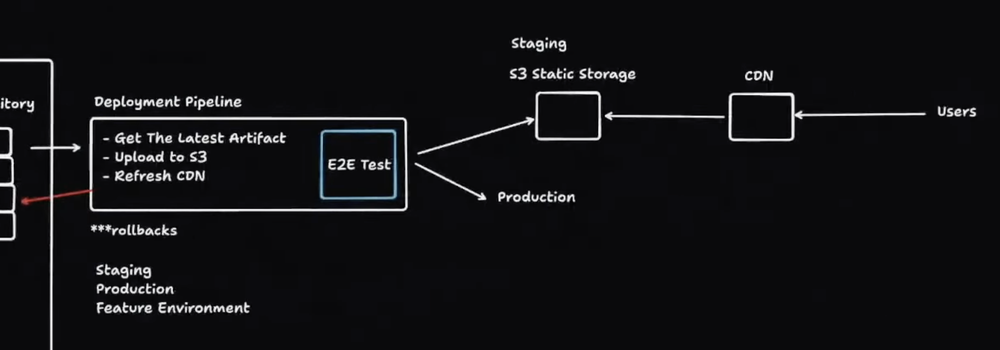

# General Purpose Coding Checklists

## Converting Junior Code to Senior Level Code
1. Functional Requirments
    - If you are fetching data you need loading/error state (can do it with state or react query)
        - loading : wraps the fetch
        - error:  try/catch wraps the promise
    - For alternative path logic return early:
        - 
        - For example loading/error cases can use if statement with a return. This early return happens before "golden path" return statement.    
2. Code organization
    - Custom hooks
        - Break away reuseable hook-based logic into its own hook
    - Seperate presentation and logic of a component. 
        - Logic
    - SOLID principles
        - Single Responsibility
            - Each component should have 1 job
            - 
        - Open/Closed 
            - Open for extensions but closed to modifications
            - This simple button can be extended with onClick/Styles but cannot be modified
            - 
        - Liskov Substitution
            - Subtypes must be substitutable for their base types
            - IconButton and Button Should be able to be used interchangeably
            - 
        - Interface Segregation
            - Don't force clients to implement irrelevant methods
            - (more simple in react dont have unsed props in you)
        - Dependency Inversion
            - High level modules should depend on abstractions, instead of lower level modules
            - Custom hooks/Render Props/Higher Order components
3. Non-functional requirements
    - Performance
        - Memo
            - Component does not rerender if props do not change
            - `const MemoizedComponent = memo(SomeComponent)`
            - In code: 
                ```javascript   
                const SomeComponent = memo(function SomeComponent(props) {});
                ```
        - useCallback
            - Cache a function between rerenders if the dependecies do not change
            - `const cachedFn = useCallback(fn, dependencies)`
            - In code: 
                ```javascript 
                const cachedFn = useCallback((x,y) => {}, [productId, referrer])
                ```
        - useMemo
            - cache the result of a calculation between re-renders.
            - `const cachedValue = useMemo(calculateValue, dependencies)`
            - In code: 
                ```javascript 
                const visibleTodos = useMemo(() => filterTodos(todos, tab), [todos, tab]);
                ```
        - Rerenders (use the dev tools to see rerenders)
        - Virualized lists (any long array's might be virtulized)
        - Shadow Dom to isolate CSS namespace
    - Scaleability (Less important in the frontend)
    - Accessibility 
        - Use semantic tags. Remove as many divs/spans as possible
    - Web Security
        - Need to sanitize any variable user can access. 
            - Even for just something that is displayed like a dropdown the user could inject JS code in the values. 
    - Sanitize user inputs (Zod)  
4. Testing
    - Jest/React testing library


## CD/CI Architecture
### Simplifed (Juinor Level) Architecture

### Detailed (Senior Level) Architecture
#### Before server components


#### After server components
Major changes
1) Artifact repository now has to server node files to do server compute

Major changes 
1) is we are no longer using a S3 serving static files. Now we need virtual servers for compute (EC2)
2) We use blue/green deploments with a loadbalancer to mitigate downtime


## Common Tools in a Stack
### NextJS project
### Express + React
